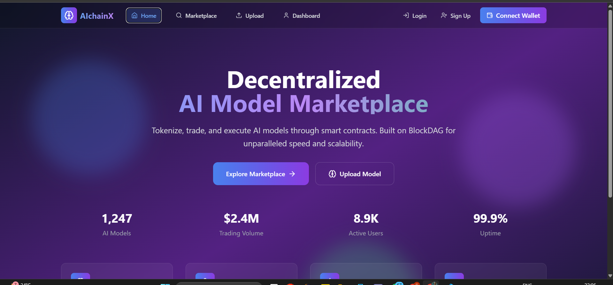
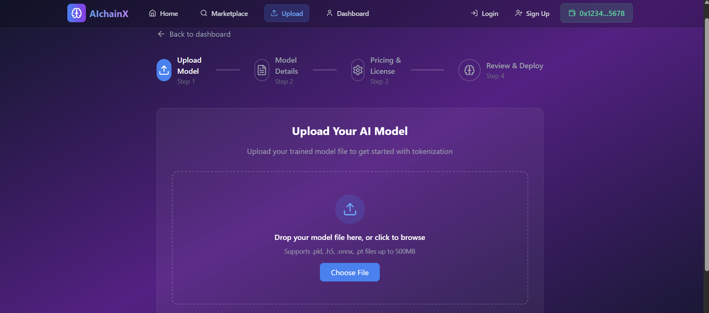
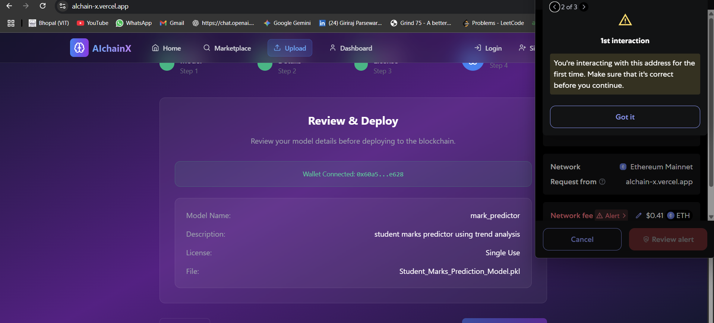

# 🌐 AlchainX — Decentralized AI Model Marketplace

**AlchainX** is a Web3-based decentralized platform that enables the **tokenization**, **trade**, and **execution** of AI models using blockchain technology. Built on the Polygon Mumbai testnet, it allows AI developers to upload and mint their trained models as NFTs (ERC-1155), creating a verifiable and tradable ownership structure around machine learning assets.

---

## 🚀 Live Prototype

🔗 [https://alchain-x.vercel.app](https://alchain-x.vercel.app)

---

## 📸 Screenshots

### 🏠 Home Dashboard
An overview of total models, user stats, and platform metrics.



### 📤 Upload Model
Drag-and-drop interface for uploading `.pkl`, `.onnx`, `.pt`, or `.h5` model files (max 500MB).



### ✅ Review & Deploy
Users connect MetaMask, verify metadata, and deploy their model on-chain.



---

## ✨ Key Features

- 🔄 Upload and tokenize AI models as **ERC-1155 NFTs**
- 🦊 MetaMask wallet integration
- 🔗 Smart contract interaction via `ethers.js`
- ⚡ Real-time deployment feedback (loading, errors, success)
- 🔍 PolygonScan link for transaction verification
- 💡 Clean, responsive UI using Tailwind CSS

---

## 🧱 Tech Stack

| Layer          | Technology                                |
|----------------|-------------------------------------------|
| Frontend       | React, TypeScript, Tailwind CSS          |
| Web3           | ethers.js, MetaMask                       |
| Smart Contract | Solidity, OpenZeppelin ERC-1155 Standard |
| Deployment     | Remix IDE                                 |
| Blockchain     | Polygon Mumbai Testnet                    |
| Hosting        | Vercel                                    |

---

## 🛠️ How It Works

1. **🧠 Upload Model**: User selects a model file and fills in name, description, license.
2. **🔐 Connect Wallet**: On the final step, MetaMask is prompted for wallet connection.
3. **📝 Mint NFT**: Form data is passed to a smart contract via `mintModel()` function.
4. **⛓️ On-chain Tokenization**: Transaction is processed on Polygon Mumbai, and model is minted as a unique NFT.
5. **🔗 Verify**: UI displays PolygonScan link for transaction proof.

---

## 📈 Prototype Statistics _(Sample)_

| Metric             | Value   |
|--------------------|---------|
| AI Models Deployed| 1,247   |
| Marketplace Volume | $2.4M   |
| Active Users       | 8,900+  |
| Platform Uptime    | 99.9%   |

---

## 🔮 Roadmap

| Feature                          | Status        |
|----------------------------------|---------------|
| 🔗 IPFS integration for storage  | 🟡 In Progress |
| 🧾 On-chain metadata (CID, JSON) | ⏳ Planned     |
| 🛒 Model marketplace (list/sell) | ⏳ Planned     |
| ⚙️ Off-chain execution + royalties | ⏳ Planned   |
| 🚀 Migration to BlockDAG network | ⏳ Planned     |

---

## 📂 Project Structure

```
AlchainX/
├── README.md
├── public/
│   └── assets/
│       ├── Home.png
│       ├── UploadModel.png
│       └── ReviewDeploy.png
├── src/
│   ├── contracts/
│   │   ├── AlchainX_MVP.sol    # ERC-1155 smart contract
│   │   └── abi.json            # Contract ABI
│   ├── components/
│   │   └── UploadModel.tsx     # Upload form component
│   ├── utils/
│   │   └── interact.js         # Smart contract integration helper
│   └── pages/
│       ├── index.tsx           # Landing page
│       └── dashboard.tsx       # Model management dashboard
```

---

## 📜 License

This project is intended for **educational, research, and prototype use**. Commercial deployment should comply with applicable regulations and open-source licenses.

---

## 🤝 Contribution

Contributions are welcome! Please:

- Fork the repo
- Create a new branch
- Submit a pull request with a clear description

---

## 📬 Contact

Questions, collaboration or feedback? Reach out:

- GitHub: [@riya9927](https://github.com/riya9927), [@giriraj-parsewar](https://github.com/giriraj-parsewar)
- Email: girirajparsewar61@gmail.com

---

> Built with 💙 by the AlchainX team — bringing decentralization to the AI revolution.
